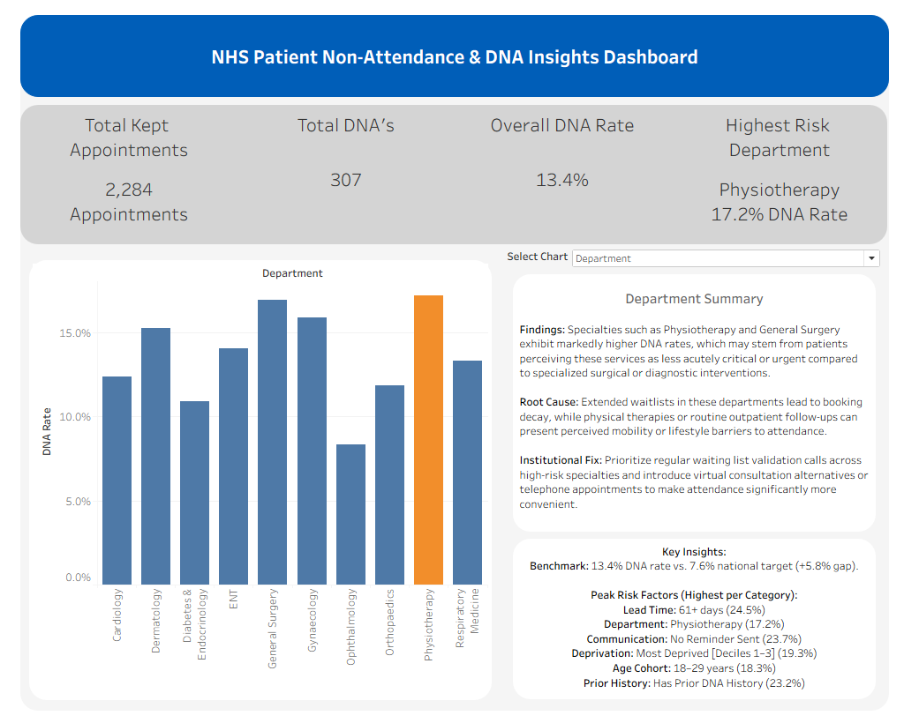

# nhs-patient-no-show-insights

An end-to-end data analytics project evaluating NHS patient DNA (Did Not Attend) patterns, featuring raw data cleaning pipelines, exploratory data analysis in Excel, an interactive Tableau executive dashboard, and strategic policy recommendations to mitigate missed appointments.

---

## 📋 Project Overview & Objectives

Outpatient non-attendance creates severe clinical backlogs, inefficient resource utilization, and extended waiting lists across the National Health Service (NHS). The primary objectives of this project are:

* **Quantify Non-Attendance:** Establish baseline metrics for overall DNA rates against national benchmarks.
* **Identify High-Risk Segments:** Isolate demographic, temporal, and clinical factors contributing to missed appointments.
* **Evaluate Interventions:** Uncover and measure diverse intervention pathways, including communication compliance, waitlist management, socio-economic support structures, and demographic-specific outreach.

---

## 🛠️ Data Cleaning & Transformation Pipeline

Data preprocessing and transformation were handled using **Power Query** to ensure data integrity, structural consistency, and readiness for analysis:

* **Type Consistency:** Separated combined date-time columns into distinct `Date` and `Time` fields, subsequently dropping negligible time elements to streamline the dataset.
* **Age Banding:** Grouped continuous patient ages into standard epidemiological cohorts: `0-17`, `18-29`, `30-44`, `45-59`, `60-74`, and `75+`.
* **Deprivation Grouping:** Aggregated Index of Multiple Deprivation (IMD) deciles into three distinct socio-economic brackets: 
  * `1–3`: Most Deprived
  * `4–7`: Moderately Deprived
  * `8–10`: Least Deprived
* **Prior DNA History Simplification:** Streamlined granular historical counts (1, 2, ..., 10+ DNAs) into a unified prior DNA history indicator.
* **Lead Time Binning:** Categorized appointment lead times into operational intervals: `0-7 days` (1 week), `8-14 days` (1-2 weeks), `15-30 days` (2-4 weeks), `31-60 days` (1-2 months), and `61+ days` (>2 months).
* **Exploratory Metric Extraction:** Extracted foundational trends to isolate primary risk factors driving DNA rates and measure performance against strategic targets.

---

## 📊 Tableau Executive Dashboard & Insights

An interactive executive dashboard was built in **Tableau** to monitor outpatient non-attendance patterns, benchmark performance against national standards, and deliver actionable operational recommendations.

(https://public.tableau.com/views/NHSDNAVisuals/Dashboard1?:language=en-US&publish=yes&:sid=&:redirect=auth&:display_count=n&:origin=viz_share_link)

### Key Architectural Features:
* **Executive KPI Banner:** Immediate visibility into total kept appointments (2,284), total DNAs (307), overall DNA rate (13.4%), and peak risk departments.
* **Dynamic Chart Switcher:** Parameter-driven views allowing stakeholders to seamlessly toggle the main visualization between **Department**, **Lead Time**, **Age Group**, **Deprivation**, **DNA History**, and **Reminder Status**.
* **Integrated Business Narrative:** Built-in contextual insight panels detailing root causes and proposed institutional fixes (e.g., automated SMS reminders for long lead times).

### Summary of Key Findings:
* **National Benchmark Gap:** The current DNA rate of **13.4%** significantly exceeds the 7.6% national target (+5.8% gap).
* **Peak Risk Segments:**
  * **Lead Time:** Appointments booked **61+ days** in advance suffer the highest non-attendance (24.5%).
  * **Department:** **Physiotherapy** exhibits the highest departmental DNA rate at 17.2%.
  * **Communication:** Failing to send appointment reminders spikes DNA rates to **23.7%**.
  * **Demographics:** Younger cohorts (**18–29 years**, 18.3%) and the most deprived socio-economic brackets (**Deciles 1–3**, 19.3%) present the highest risk profiles.
  * **History:** Patients with prior DNA records are substantially more likely to miss future appointments (23.2%).

---

## 📁 Repository Structure

To maintain a strict audit trail and separate source data from transformed assets, the project is organized into the following directory structure:

```text
nhs-patient-no-show-insights/
│
├── data/
│   ├── raw/
│   │   └── nhs_outpatient_appointments.csv     # Original, unedited source dataset
│   └── processed/
│       └── nhs_outpatient_appointments_cleaned.xlsx # Fully cleaned, transformed, and analyzed workbook
│
├── LICENSE
└── README.md
